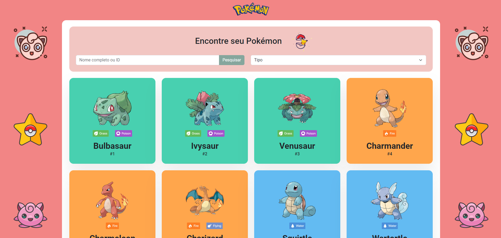
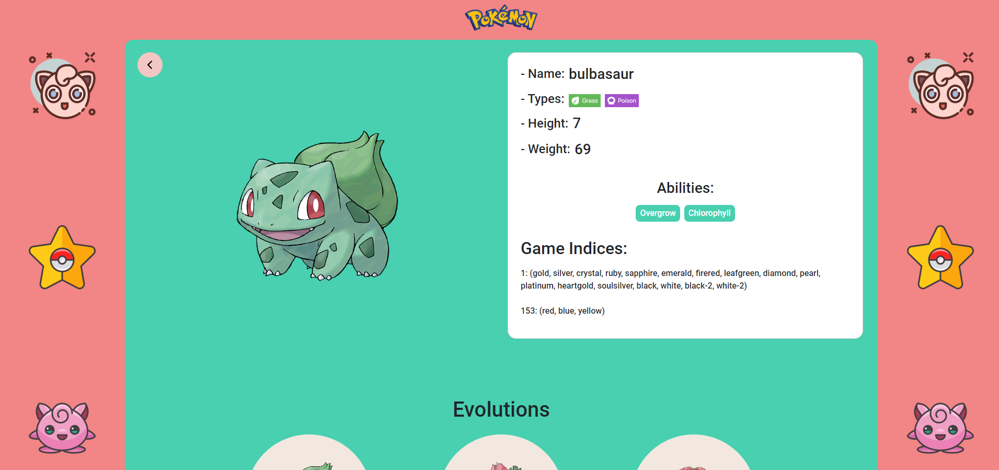
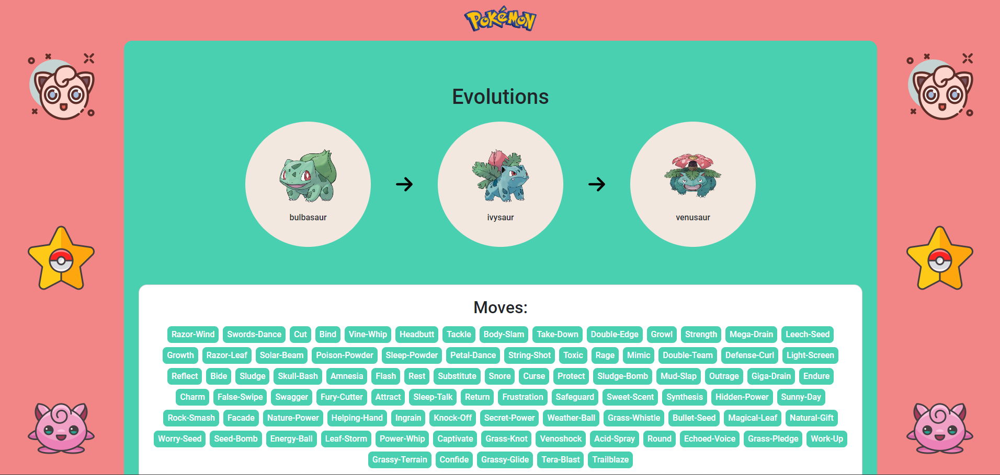
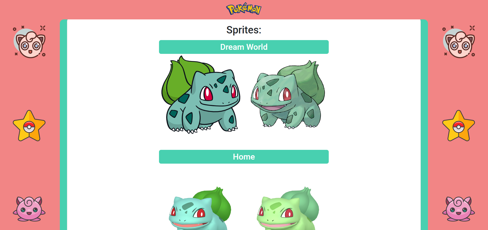
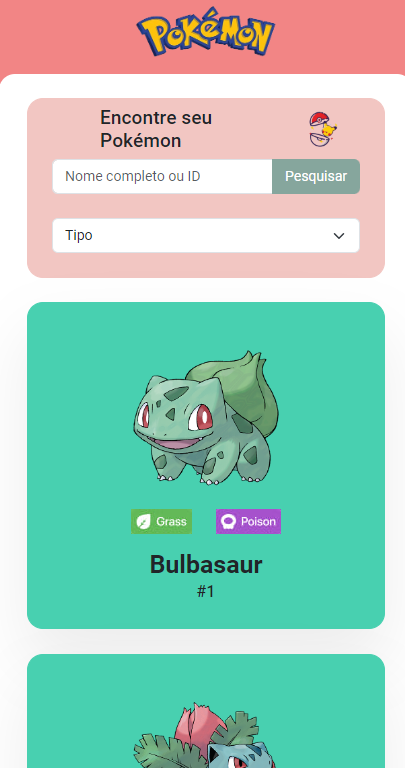
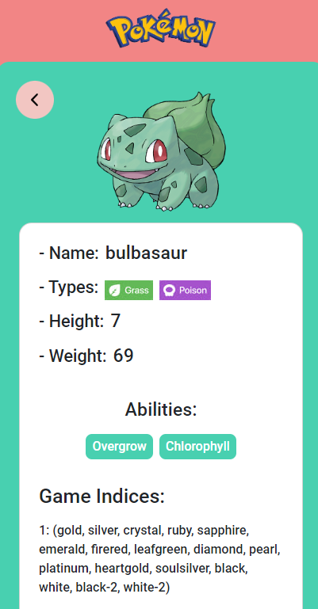
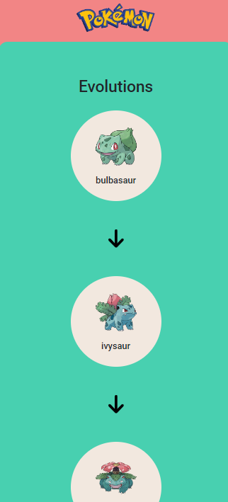
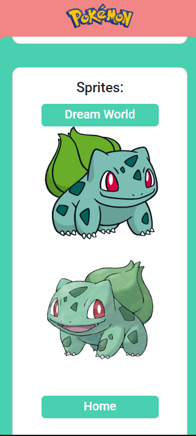

# Projeto Pokedex

A Pokedex é um programa desenvolvido em VueJS onde é possível listar todos os Pokemóns, ver detalhes de um pokémon, evoluções, estatísticas e se divertir com seus amigos!

## Indice
- <a href="#funcionalidades">Funcionalidades do Projeto</a>
- <a href="#layout">Layout</a>
- <a href="#demonstracao">Demonstração</a>
- <a href="#rodar">Como rodar o projeto?</a>
- <a href="#tecnologias">Tecnologias Utilizadas</a>
- <a href="#passos">Próximos Passos</a>

<a id="funcionalidades"></a>
## :iphone: Funcionalidades do Projeto

- [x] Listar os Pokémons
- [x] Filtrar os pokémons por nome completo, ID e Tipo
- [x] Scroll Infinito de Pokémons
- [x] Ver os detalhes do Pokémons (Evoluções, Fotos, Características)

<a id="layout"></a>
## :computer: Layout
Versão desktop:<br>





Versão Mobile:<br>





<a id="demonstracao"></a>
## :bulb: Demonstração
[Acesse aqui](https://pokedex-eight-umber.vercel.app/)

<a id="rodar"></a>
## :mag_right: Como rodar o projeto?
### 1 - Clone o repositório
```bash
$ git clone https://github.com/Adri210/Pokedex.git
```
### 2 - Acesse a pasta do projeto no seu terminal
```bash
$ cd ./Pokedex
```
### 3 - Instale as dependências (Projeto feito na versão 20.12.2 do Node)
```bash
$ npm install
```
### 4 - Execute a aplicação
```bash
$ npm run dev
```
### 5 - A aplicação será iniciada na porta 5173, acesse pelo navegador:
```bash
http://localhost:5173/
```
<a id="tecnologias"></a>
## :wrench: Tecnologias Utilizadas
1. [VueJS](https://vuejs.org/)
2. [Bootstrap](https://getbootstrap.com/)
3. [Sass](https://sass-lang.com/)
4. [VueUse](https://vueuse.org/)
5. [Vuex](https://vuex.vuejs.org/)
6. [Vue Router](https://router.vuejs.org/)
7. [Axios](https://axios-http.com/)
7. [Vite](https://vitejs.dev/)

<a id="passos"></a>
## :hammer: Próximos passos
- [ ] Implementar tradução para Inglês e Espanhol
- [ ] Implementar testes unitários e de integração com Vitest
- [ ] Implementar Typescript